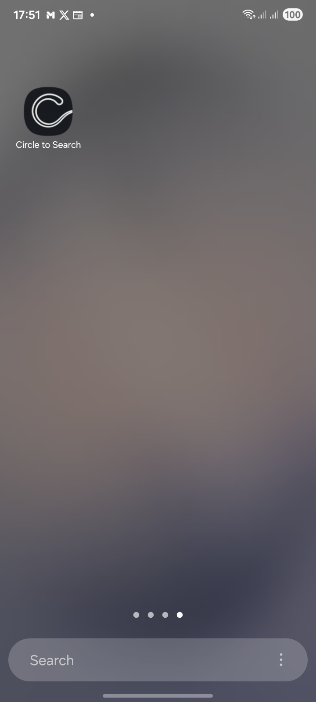
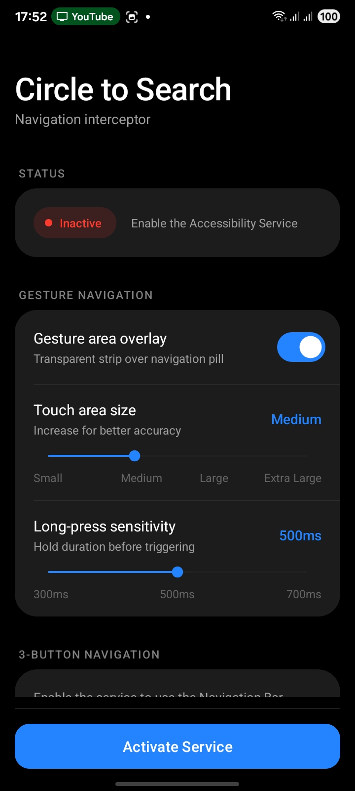
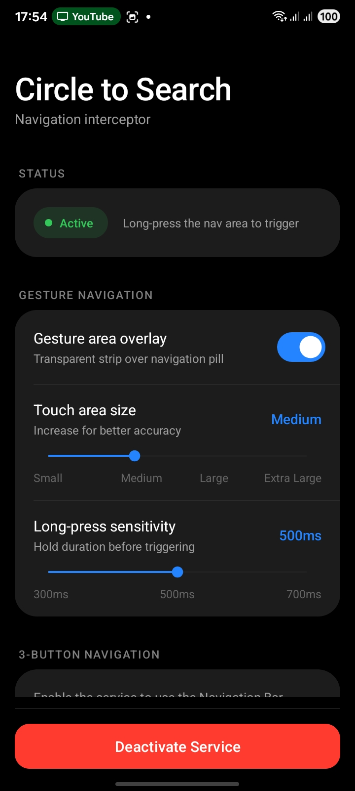
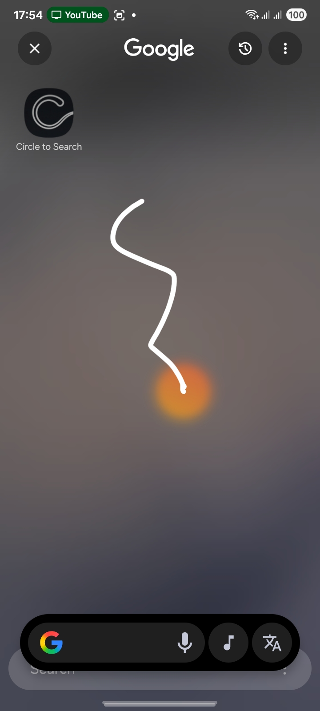
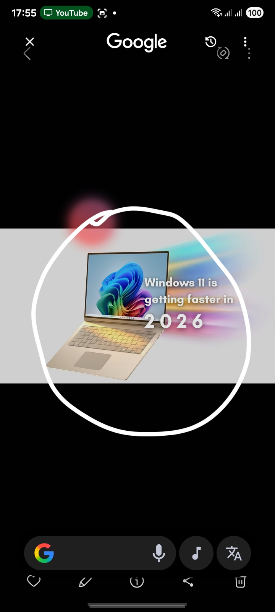
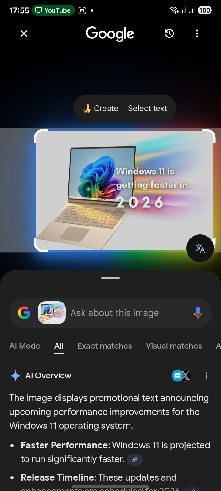

# Circle to Search Helper

A utility app that seamlessly enables triggering Google's "Circle to Search" functionality on Android devices using transparent gesture overlays and Accessibility Services.

## Demo

  
  
  

  
  
  

## How to Operate

1. **Install and Open:** Open the application after installation.
2. **Access Settings:** Click the **Activate Service** button. This will redirect you to the Android Accessibility settings page based on your OS model.
3. **Enable Accessibility Service:**
   - Under `Installed apps`, tap on **Circle to Search**.
   - Enable the main toggle.
   - You may also see an option for **Circle to Search shortcut**. Enable that toggle, then tap "Allow". If your system prompts you to select an option (e.g., tap accessibility button or hold volume keys), select one and you're good to go.
4. **Trigger Circle to Search:**
   - **3-Button Navigation:** Simply tap the newly added Accessibility person/shortcut icon located on your navigation bar.
   - **Gesture Navigation:** Long-press cleanly at the bottom center of your screen over the navigation pill. (Ensure that "Gesture area overlay" is enabled inside this app's UI).

> **Note:** The gesture navigation area is enabled by default so you don't even have to open the app manually once the service is started!

## Why is it required?
On certain configurations or models, Google restricts native invocation for Circle to Search. This application safely queries the background service specifically for the `omni_entry` intent, triggering Google exactly like the original experience without needing root.
