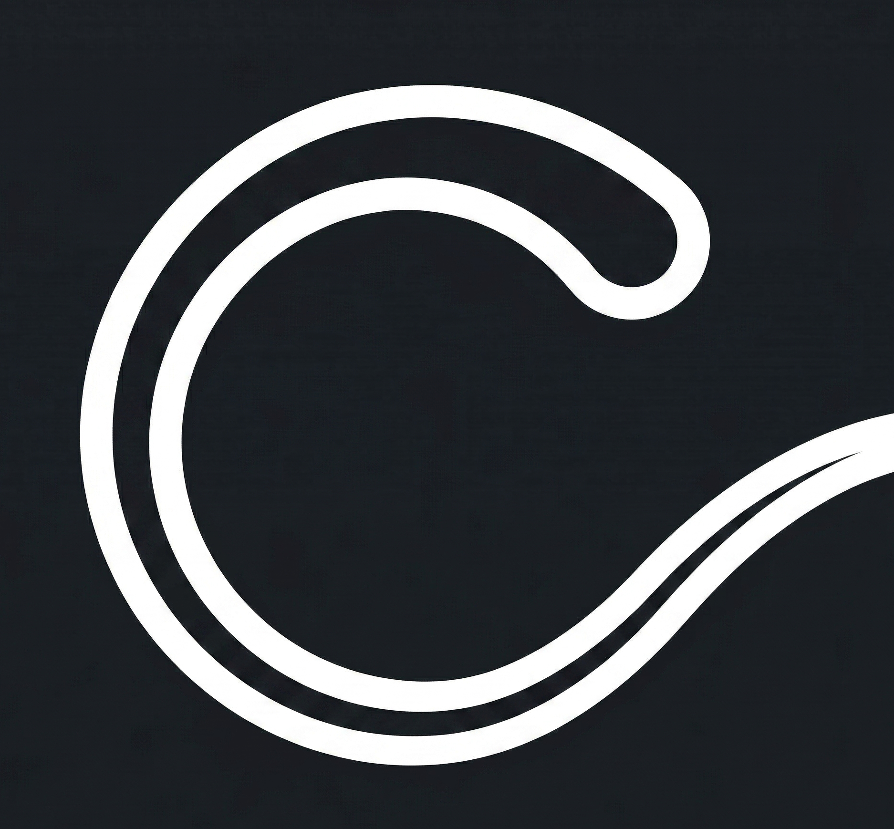

  
  <h1>Circle to Search Helper</h1>
  
<b>A lightweight Android utility to seamlessly invoke Google's Circle to Search via custom gesture overlays and accessibility shortcuts without root.</b>

## ✨ Introduction
Google restricts native invocation for *Circle to Search* on certain models or setups. This lightweight application actively bridges the gap by safely opening the `omni_entry` backdoor using hidden Android APIs. 

Because it operates natively as an **Accessibility Service**, there are no sticky background notifications to worry about, and it completely bypasses the need for the *"Draw over other apps"* permissions that plagued older solutions!

---

## 🚀 Features
- **Native Accessibility Integration:** Clean and robust background summoning of Circle to Search.
- **3-Button Navigation Support:** Adds a dedicated Accessibility Button right onto your nav bar.
- **Gesture Bar Overlay:** A built-in, invisible screen-bottom listener triggers the search when long-pressed.
- **High Customizability:** Easily adjust touch vibration intensity, haptic feedback profiles, and gesture area bounds.
- **No Root Required:** Flawlessly replicates the standard Launcher behaviour out-of-the-box.

---

## 📸 Demo

  
  
  
    
  
  
  

---

## 🛠️ How to Operate

1. **Install and Open:** Launch the application after installation.
2. **Access Settings:** Tap the **Activate Service** button. This securely reroutes you to the Android Accessibility settings natively on your OS.
3. **Enable Accessibility Service:**
   - Scroll to **Installed apps** and tap on **Circle to Search**.
   - **Enable** the main toggle.
   - Most devices will display a prompt for a **Circle to Search shortcut**. Enable that toggle and grant "Allow". (If your system prompts you to select an interaction, such as tapping the accessibility button or holding volume keys, select your preference).
4. **Trigger Circle to Search!**
   - **Using 3-Button Navigation:** Tap the newly added Accessibility (person) shortcut icon anchored to your navigation bar.
   - **Using Gesture Navigation:** Perform a clean long-press at the bottom-center of your screen over the navigation pill. *(Note: The transparent gesture area listener is enabled by default!).*

---

## 🤝 Contributing
Contributions, issues, and feature requests are highly appreciated! Feel free to check the [issues page](../../issues) and the [CONTRIBUTING.md](./CONTRIBUTING.md) to get started!

---

## 📄 License
This project is licensed under the [MIT License](./LICENSE).

---

  Built with ❤️ by Android Enthusiasts.

